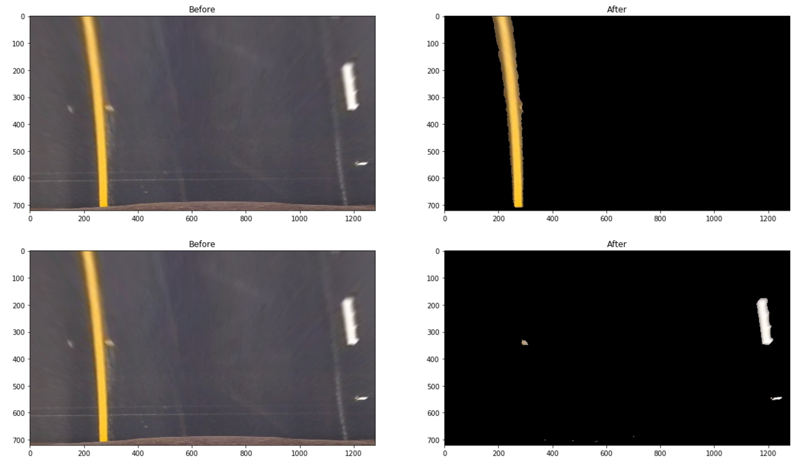
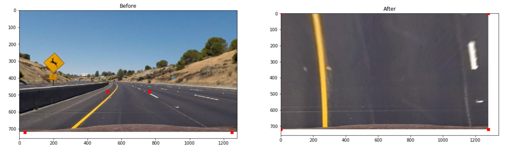
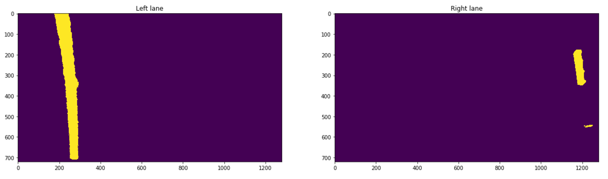

# Advanced Lane Finding
> Implementing an advanced lane-finding algorithm using computer vision techniques to enhance autonomous driving systems.

This project develops a comprehensive lane-finding algorithm that incorporates distortion correction, image rectification, color transforms, gradient thresholding, and perspective transformations to accurately identify lane boundaries, curvature, and the vehicle's displacement from the center. The algorithm is robust against environmental challenges such as shadows, pavement changes, and varying lighting conditions.

### Project Objectives
- **Camera Calibration**: Compute camera calibration matrix and distortion coefficients using chessboard images to correct distortion in road images.
- **Distortion Correction**: Apply distortion correction to raw images to ensure accurate lane detection.
- **Binary Image Creation**: Use color transforms and gradients to generate thresholded binary images that highlight lane lines.
- **Perspective Transformation**: Apply perspective transform to obtain a "bird's-eye view" of the roadway, facilitating lane detection.
- **Lane Detection**: Identify lane pixels, fit polynomial functions to lane lines, calculate lane curvature, and estimate vehicle position.
- **Visualization**: Overlay lane boundaries on the original image and provide real-time feedback on lane curvature and vehicle position.

### Technical Highlights

#### Camera Calibration and Image Correction
- Utilized chessboard images to calibrate the camera, correcting for distortion and improving the accuracy of lane detection.

  
  

#### Thresholded Binary Image
- Combined color and gradient thresholds to isolate lane lines, creating a binary image that serves as the foundation for lane detection.

  

#### Perspective Transform
- Implemented perspective transformation to warp the image to a "bird's-eye view", enabling precise lane detection and curvature calculation.

  

#### Lane Detection and Curvature
- Employed image processing techniques to detect lane boundaries and calculate lane curvature, addressing the critical safety component of autonomous driving.

  

### Pipeline Results
- **Video Implementation**: Successfully applied the lane-finding pipeline to video streams, demonstrating the algorithm's effectiveness in real-world driving scenarios.

  - [Basic Video Output](https://www.youtube.com/watch?v=xgv6zKWNXYM)
  - [Advanced Video Output](https://www.youtube.com/watch?v=ng9edgddoms)

### Discussion and Future Work

The current pipeline, while effective in standard driving conditions, faces challenges with rapid changes in road curvature and extreme environmental conditions. Future enhancements will focus on:
- **Dynamic Outlier Handling**: Improving the algorithm's response to sudden changes in curvature by refining outlier detection and incorporating predictive modeling.
- **Robust Lane Detection**: Enhancing lane line detection algorithms to better handle diverse and challenging road conditions, potentially through the integration of deep learning techniques.
- **Real-Time Processing**: Optimizing the pipeline for real-time application in autonomous driving systems, ensuring swift and accurate lane finding under all conditions.
